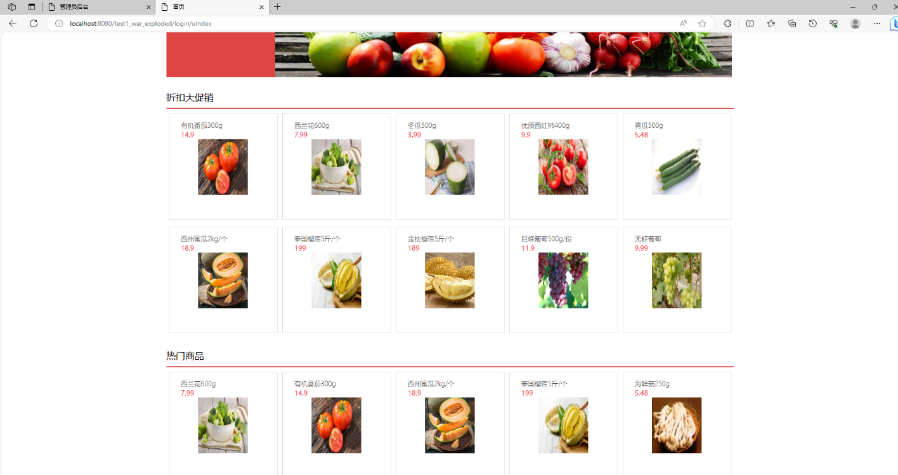
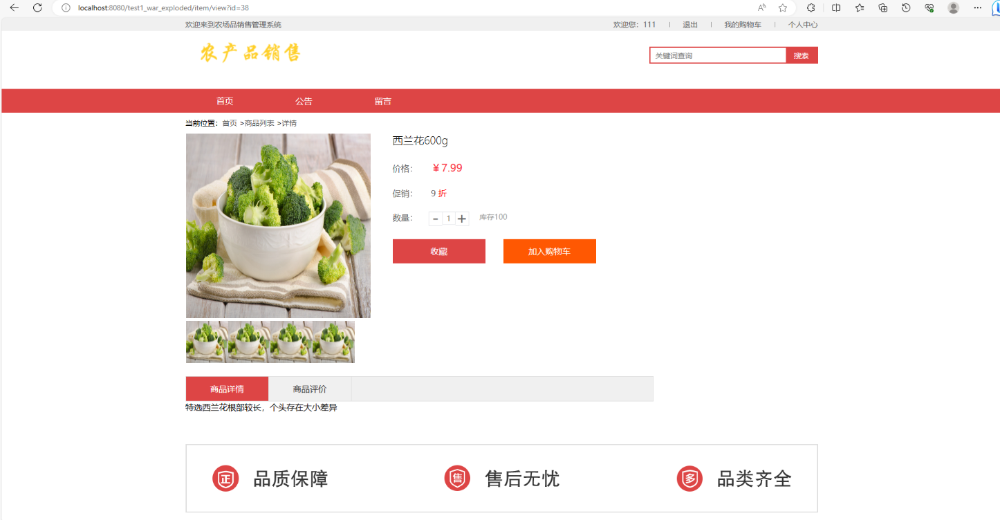
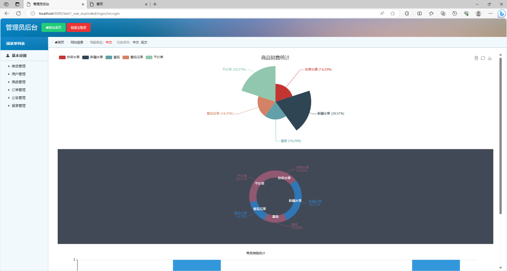

# 基于SSM的农产品销售管理系统

## 一、介绍

功能（用户端+管理端）:

用户前台功能：登陆，注册，商品分类，搜索，商城首页浏览，查看商品详情页面，收藏与加入购物车（需登录使用），订单，留言功能，个人中心

管理后台功能：类目管理功能（对前台商品分类，增加和删除类目），用户管理，商品管理，订单管理，公告管理，留言管理

语言：java

技术：ssm（spring+spring MVC+mybatis）+jsp+jQuery

数据库：mysql

完整项目获取

通过网盘分享的文件：农产品销售管理系统

链接: https://pan.baidu.com/s/1ykBhQRp_glH_EuvTkHovGw?pwd=5qyn 提取码: 5qyn
--来自百度网盘超级会员v3的分享

通过网盘分享的文件：工具包

链接: https://pan.baidu.com/s/1YmdoJvkjoUjA75wvHLDZ6A?pwd=xm96 提取码: xm96
--来自百度网盘超级会员v3的分享

通过网盘分享的文件：远程调试部署联系方式

链接: https://pan.baidu.com/s/1W0dDcoZmayG0c7USJDYBYg?pwd=nqd7 提取码: nqd7
--来自百度网盘超级会员v3的分享

## 二、系统部分功能页面展示

